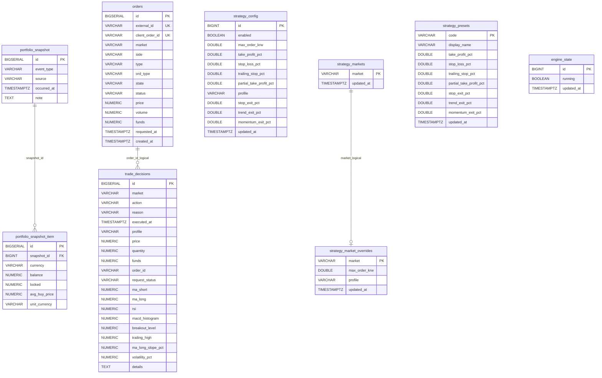

# ERD

## Notes

- The only physical FK in `schema.sql` is:
  - `portfolio_snapshot_item.snapshot_id -> portfolio_snapshot.id`
- `strategy_markets -> strategy_market_overrides` and `orders -> trade_decisions` are logical relationships, not DB-level FK constraints.

